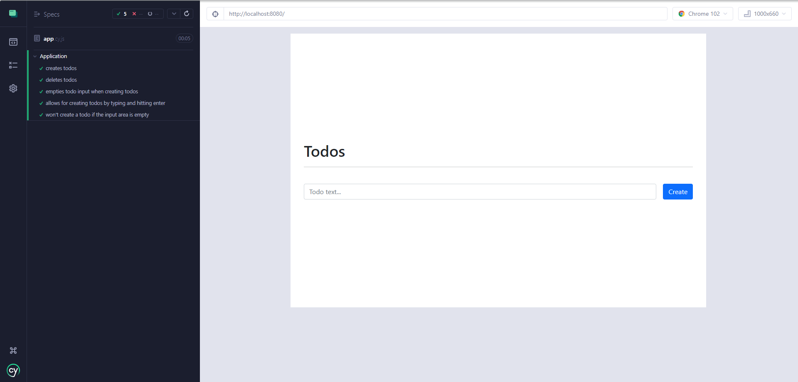

Cypress Todo App
======================================================================

Simple todo app used to test cypress testing

Running Cypress
-----------------------------------------------------------------------

Uses Node and NPM

Steps:

- Install dependencies: `npm install`
- Run dev server: `npm start`
- In a separate terminal, open cypress testing ui: `npm run test:open`
- Click "E2E Testing"
- Click "Start E2E Testing in [selected browser]"
- Click "app.cy.js"
- You should see a browser window with the app displayed
    and cypress running each test (as shown above)